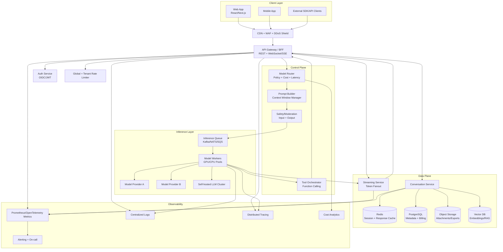

# Scalable AI Chat System Architecture (ChatGPT-like)

## 1) High-level goals

- **Low latency UX**: first token in < 1 second for warm paths.
- **Reliable streaming**: clients should receive partial tokens continuously and recover from transient failures.
- **Elastic throughput**: scale from hundreds to millions of concurrent chat sessions.
- **Cost-aware inference**: route requests to model/provider tiers, cache aggressively, and control context growth.
- **Strong safety + governance**: authN/authZ, abuse controls, observability, and compliance-ready data lifecycle.

---

## 2) Architecture diagram



---

## 3) Frontend architecture

### Stack
- **SPA/SSR hybrid** (e.g., Next.js):
  - SSR for landing/auth pages and SEO.
  - CSR for chat interface and real-time updates.
- **State model**:
  - Local UI state (composer, optimistic messages, token buffer).
  - Server state (conversations, history, limits) via React Query/SWR.
- **Transport**:
  - Primary: **SSE** for token streaming (simple, proxy-friendly).
  - Optional: WebSocket for bidirectional tools/events at high scale.

### Frontend modules
- Conversation list panel.
- Message timeline with incremental rendering.
- Composer with attachment support.
- Token stream reconciler (merges chunks and handles retries).
- Usage + quota indicator.

### Tradeoffs
- **SSE vs WebSocket**:
  - SSE: easier infra + reconnection semantics; one-way only.
  - WebSocket: richer interactivity, harder ops/load balancing.

---

## 4) Backend services

1. **API Gateway / BFF**
   - Validates JWT, enforces request schema, sets tenant context.
   - Handles idempotency keys for message sends.
2. **Conversation Service**
   - Creates threads/messages, pagination, soft delete, export.
3. **Model Router**
   - Chooses model by policy: latency target, cost ceiling, tenant tier, language, safety class.
4. **Prompt Builder**
   - Assembles system prompts, history summary, RAG snippets, and tool results.
5. **Safety/Moderation Service**
   - Input and output moderation with configurable thresholds.
6. **Streaming Service**
   - Buffers model tokens and fans out to clients.
7. **Tool Orchestrator**
   - Executes function calls with timeouts, retries, and audit logs.
8. **Billing/Usage Service**
   - Token accounting, per-tenant quotas, invoice events.

---

## 5) Streaming response design

### Request flow
1. Client sends `POST /v1/chat/messages` with `conversation_id`, `message`, and `stream=true`.
2. BFF returns stream channel URL or directly opens SSE.
3. Backend emits events:
   - `message.started`
   - `token.delta` (repeated)
   - `tool.call.started` / `tool.call.completed` (optional)
   - `message.completed`
   - `message.error`
4. Final message persisted only on completion (or marked partial on failure).

### Reliability patterns
- **Sequence numbers** on chunks to support dedupe/reorder checks.
- **Resume token** (`last_event_id`) for reconnect.
- **Write-ahead partial buffer** in Redis for in-flight streams.
- **Idempotency key** to avoid duplicate model invocations.

### Tradeoffs
- Persisting every token enables replay but increases write amplification.
- Persist-on-complete is cheaper but loses some partial history on failures.

---

## 6) Conversation storage design

### Storage split
- **PostgreSQL**: conversations, messages metadata, billing, user settings.
- **Object storage**: large attachments, exports, raw traces.
- **Vector DB**: embeddings for retrieval (optional, workspace docs).
- **Redis**: hot conversation cache, active stream buffers.

### Retention
- Hot data in SQL (e.g., 30–90 days) + archival tier policy.
- Tenant-configurable retention + legal hold flags.

---

## 7) Caching strategy

1. **Request-level cache** (short TTL)
   - Duplicate prompts from same user within seconds.
2. **Semantic cache**
   - Similar prompt embedding match for FAQ-style workloads.
3. **Conversation summary cache**
   - Cached rolling summaries to reduce repeated token usage.
4. **Model routing cache**
   - Store recent health/cost metrics for quick routing decisions.

### Risks
- Stale cache can leak outdated or incorrect answers.
- Must include tenant/user scoping keys to prevent cross-tenant leaks.

---

## 8) Rate limiting and abuse prevention

### Multi-layer limits
- **Edge (CDN/WAF)**: IP + geo + bot signatures.
- **Gateway**: user/tenant QPS + concurrent streams.
- **Model layer**: tokens/min, tokens/day, max context length.

### Algorithms
- Token bucket for burst + sustained control.
- Sliding window for fair quota reporting.

### Abuse controls
- Prompt injection detection heuristics.
- Automated account throttling + challenge (CAPTCHA/step-up auth).

---

## 9) Authentication & authorization

- **OIDC/OAuth2** for user login (PKCE for public clients).
- JWT access tokens (short-lived) + refresh tokens.
- Service-to-service auth with mTLS + workload identity.
- RBAC/ABAC:
  - Roles: user, admin, billing-admin.
  - Policies: tenant-scoped resources and model access tiers.

---

## 10) Horizontal scaling strategy

### Stateless tiers
- BFF, routing, moderation, and tool orchestration should be stateless and autoscaled by:
  - CPU, p95 latency, queue depth, active streams.

### Stateful tiers
- SQL: primary + read replicas; partition by tenant/time at scale.
- Redis: clustered with replica shards.
- Queue: partition by conversation/tenant hash.

### Inference scaling
- Separate GPU pools by model class (small/medium/large).
- Queue-based admission control to protect GPUs.
- Fallback routing to alternate providers on saturation.

---

## 11) Cost optimization

1. **Dynamic model routing**
   - Use small/cheap model for simple prompts; escalate when needed.
2. **Context compaction**
   - Rolling summary + semantic retrieval instead of full history replay.
3. **Token budgeting**
   - Hard max output tokens and adaptive stop criteria.
4. **Caching**
   - Short-circuit repeated prompts and repeated retrieval contexts.
5. **Batching and prefix caching** (provider-dependent)
   - Improve throughput and reduce per-token overhead.
6. **FinOps feedback loop**
   - Track cost per successful conversation and per tenant.

---

## 12) Database schema (example)

```sql
-- Tenants and users
CREATE TABLE tenants (
  id UUID PRIMARY KEY,
  name TEXT NOT NULL,
  plan TEXT NOT NULL,
  created_at TIMESTAMPTZ NOT NULL DEFAULT now()
);

CREATE TABLE users (
  id UUID PRIMARY KEY,
  tenant_id UUID NOT NULL REFERENCES tenants(id),
  email TEXT UNIQUE NOT NULL,
  role TEXT NOT NULL,
  created_at TIMESTAMPTZ NOT NULL DEFAULT now()
);

-- Conversations and messages
CREATE TABLE conversations (
  id UUID PRIMARY KEY,
  tenant_id UUID NOT NULL REFERENCES tenants(id),
  user_id UUID NOT NULL REFERENCES users(id),
  title TEXT,
  model_policy TEXT,
  created_at TIMESTAMPTZ NOT NULL DEFAULT now(),
  updated_at TIMESTAMPTZ NOT NULL DEFAULT now(),
  deleted_at TIMESTAMPTZ
);

CREATE TABLE messages (
  id UUID PRIMARY KEY,
  conversation_id UUID NOT NULL REFERENCES conversations(id),
  tenant_id UUID NOT NULL REFERENCES tenants(id),
  role TEXT NOT NULL CHECK (role IN ('system','user','assistant','tool')),
  content TEXT,
  content_json JSONB,
  token_input INT,
  token_output INT,
  model TEXT,
  status TEXT NOT NULL DEFAULT 'completed',
  created_at TIMESTAMPTZ NOT NULL DEFAULT now()
);

-- Streaming chunks (optional, if replay needed)
CREATE TABLE message_chunks (
  id BIGSERIAL PRIMARY KEY,
  message_id UUID NOT NULL REFERENCES messages(id),
  seq INT NOT NULL,
  delta TEXT NOT NULL,
  created_at TIMESTAMPTZ NOT NULL DEFAULT now(),
  UNIQUE (message_id, seq)
);

-- Usage and billing
CREATE TABLE usage_events (
  id BIGSERIAL PRIMARY KEY,
  tenant_id UUID NOT NULL REFERENCES tenants(id),
  user_id UUID REFERENCES users(id),
  conversation_id UUID REFERENCES conversations(id),
  message_id UUID REFERENCES messages(id),
  model TEXT NOT NULL,
  input_tokens INT NOT NULL,
  output_tokens INT NOT NULL,
  cost_usd NUMERIC(12,6) NOT NULL,
  created_at TIMESTAMPTZ NOT NULL DEFAULT now()
);

CREATE INDEX idx_messages_conversation_created
  ON messages (conversation_id, created_at);

CREATE INDEX idx_usage_tenant_created
  ON usage_events (tenant_id, created_at);
```

---

## 13) Deployment architecture

### Recommended baseline (Kubernetes, multi-AZ)
- **Ingress**: managed LB + WAF.
- **Stateless workloads**: BFF, router, moderation, tool orchestrator.
- **Stateful managed services**:
  - Managed PostgreSQL (HA + backups + PITR).
  - Managed Redis cluster.
  - Managed queue/streaming bus.
- **Inference**:
  - Option A: external model APIs.
  - Option B: dedicated GPU node groups for self-hosted models.
  - Option C: hybrid (default for resilience + cost).

### Multi-region strategy
- Active-active for read + inference routing.
- Active-passive for write-heavy conversation storage (or global DB if required).
- Geo-aware routing for latency and data residency.

### Tradeoffs
- Multi-region active-active lowers latency but increases consistency complexity and cost.

---

## 14) Monitoring and logging

### Metrics (golden signals)
- Latency: p50/p95/p99 for first token and completion.
- Traffic: RPS, active streams, queue depth.
- Errors: moderation failures, model timeouts, tool failures.
- Saturation: CPU/mem/GPU utilization, DB connections, Redis hit ratio.
- Business: cost per conversation, success rate, retention.

### Logging
- Structured JSON logs with correlation IDs:
  - `request_id`, `conversation_id`, `tenant_id`, `user_id`, `model`, `provider`.
- PII redaction and configurable sampling.

### Tracing
- End-to-end spans: gateway → routing → inference → streaming.
- Annotate token counts, model selected, retries, and fallback decisions.

### Alerting
- SLO-based alerts:
  - First token latency SLO breach.
  - Error budget burn rate.
  - Cost anomaly detection.

---

## 15) Key tradeoff summary

1. **SSE vs WebSocket**
   - SSE simpler for chat token streams; WebSocket better for rich duplex events.
2. **Managed model APIs vs self-hosted models**
   - Managed: faster to ship, less infra burden; Self-hosted: potentially lower unit cost at scale, higher ops complexity.
3. **Persist-all tokens vs persist-final-only**
   - Persist-all supports replay/debug; persist-final reduces storage/write load.
4. **Single-region vs multi-region**
   - Single-region simpler/cheaper; multi-region improves latency and resilience.
5. **SQL-only vs polyglot storage**
   - SQL-only simpler; polyglot (SQL + Redis + vector + object) better fit at scale.

---

## 16) Practical phased rollout

- **Phase 1 (MVP)**: BFF + SQL + Redis + single model provider + SSE.
- **Phase 2**: Add model router, moderation pipeline, usage billing, and vector retrieval.
- **Phase 3**: Multi-provider failover, GPU pools, multi-region read scale, advanced FinOps.


---

## 17) How to test this architecture

Use a **progressive test pyramid**: local correctness → integration → load/chaos → production SLO validation.

### A. Local and component tests
- **API contract tests** for `POST /v1/chat/messages`, stream event schema, auth failures, and rate-limit responses.
- **Prompt assembly unit tests** for truncation, summary insertion, and tool-output injection.
- **Router policy tests** to verify model selection under cost/latency constraints.
- **Moderation tests** for blocked, allowed, and borderline prompts.

### B. Integration tests (pre-prod)
- Stand up minimal stack: gateway, conversation service, Redis, Postgres, queue, one model backend.
- Validate the full flow:
  1. Create conversation.
  2. Send streamed message.
  3. Assert event order: `message.started` → `token.delta*` → `message.completed`.
  4. Disconnect mid-stream and resume with `last_event_id`.
  5. Verify final persistence in `messages` and usage records in `usage_events`.

### C. Streaming reliability tests
- Inject network interruption during SSE/WebSocket stream and assert client resume behavior.
- Replay duplicate chunk sequence numbers and ensure dedupe.
- Kill one stream worker during active generation and verify reconnection path and partial buffer recovery from Redis.

### D. Data-layer tests
- **Migration tests**: apply schema from scratch and from N-1 release.
- **Query performance tests** on:
  - message timeline reads by `conversation_id` + `created_at`.
  - tenant usage aggregation by time window.
- **Retention tests**: TTL/archive jobs and legal-hold exceptions.

### E. Security and abuse tests
- Authentication: expired JWT, invalid signature, tenant boundary enforcement.
- Authorization: user cannot read/write other tenant conversations.
- Rate limiting: burst + sustained limits at edge and gateway.
- Prompt-injection and tool-allowlist tests (especially for function calling).

### F. Load and scale tests
- Generate synthetic traffic with mixed prompt sizes and stream durations.
- Track these SLOs under load:
  - first-token p95
  - completion p95
  - stream interruption rate
  - queue wait time
  - error rate
- Run “brownout” tests: disable primary model provider and verify fallback provider routing.

### G. Cost validation tests
- Compare actual token usage vs estimated usage per request.
- Validate routing policy shifts traffic to lower-cost models for simple prompts.
- Measure cache hit rates (request cache + semantic cache) and resulting cost/request reduction.

### H. Suggested CI/CD gates
- **PR gate**: unit + API contract + lint.
- **Pre-merge nightly**: integration + migration + moderate load test.
- **Pre-release**: production-like soak test (4–24h) with failure injection.
- **Post-deploy**: canary analysis on latency/error/cost before 100% rollout.

### I. Minimal pass criteria before production
- First-token p95 within target (e.g., <1.5s for warm path).
- End-to-end error rate below target (e.g., <1%).
- No cross-tenant data access in authZ tests.
- Fallback routing proven in provider outage simulation.
- Cost per successful conversation within budget guardrail.
